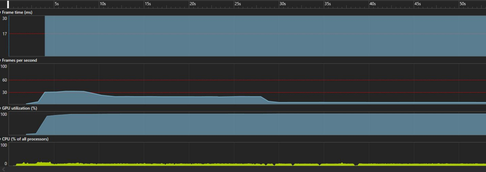
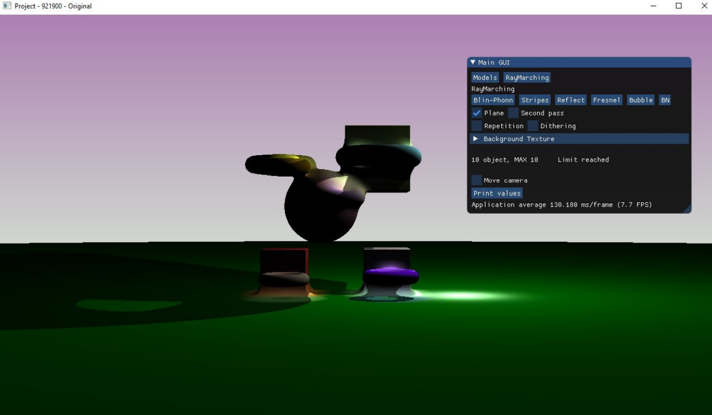
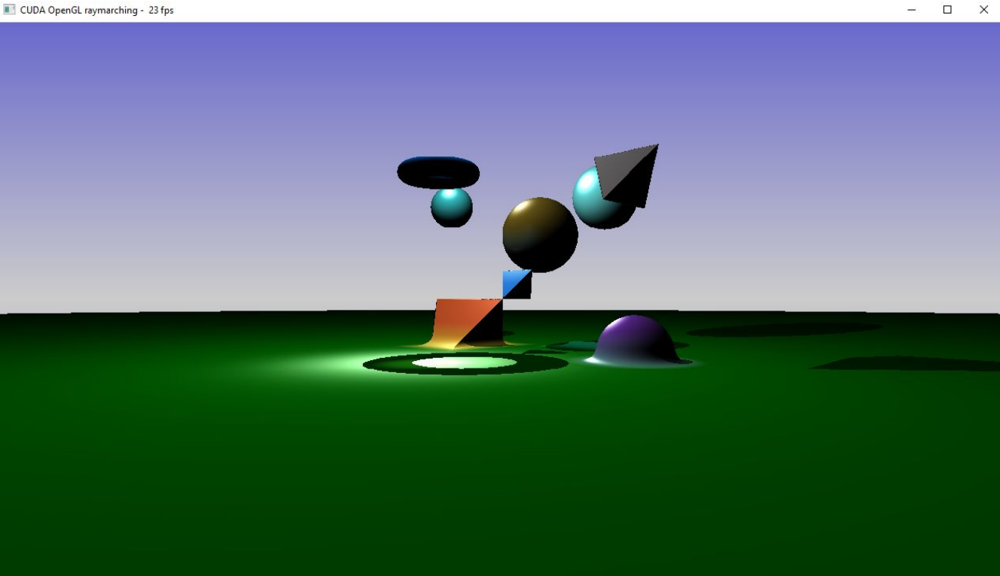

> Progetto Bassi Francesca 921900 - Ray-Marching w/ CUDA

# Implementazione
## Librerie
glut: sta per “OpenGL Utility Toolkit”, considerando che la versione ufficiale è stata
abbandonata, la libreria usata si chiama in realtà freeglut, versione open-source
mantenuta. Serve per creare finestre, inizializzare il contesto OpenGL e gestire gli input.
glew: sta per “OpenGL Extension Wrangler Library”, si tratta dell’implementazione della
specifica di OpenGL adatta per un sorgente scritto in c/c++.
## Codice HOST
### main:
L’applicativo inizia con il main, in questa porzione di codice vengono inizializzate le strutture
dati usate e la creazione della finestra di dimensione fissata.
In questa fase vengono associate delle coroutine a glut.
Le coroutine sono usate per gestire:
* input da tastiera con `glutKeyboardFunc(keyboard)`,
* controllo del tempo con `glutTimerFunc(timerEvent)`,
* gestione e renderizzazione della finestra `glutDisplayFunc(display)`.

Successivamente si inizializzano le informazioni dei buffer per permettere un bind con
CUDA, infatti i buffer di OPENGL devono essere accessibili da CUDA.

Si genera randomicamente una scena di 10 elementi con posizione, dimensione, forma
randomica, prese da un insieme di forme prestabilito, e si memorizza in una struttura dati.

Si alloca lo spazio in `global memory device` per l’array float3 `device` che conterrà
tutti i colori elaborati da ogni thread per ogni singolo pixel.

Si popola la constant memory device con le strutture dati che i thread dovranno
utilizzare per il calcolo di una scena parametrizzata.
L’ultima istruzione importante è glutMainLoop(), che esegue all'infinito il “rendering loop”
dove viene chiamata ciclicamente la funzione legata con glutDisplayFunc(display).

### display:

Si tratta della funzione chiamata al termine del main, viene eseguita ciclicamente nel
rendering loop e si occupa di fare da launcher del kernel.
Al termine dell’esecuzione del kernel si renderizza la scena assegnando i valori alle funzioni
di OpenGL per permettere il rendering all’interno della finestra generata.
Per calcolare in modo approssimato gli FPS dell’applicazione, ovvero la quantità di frame
renderizzati al secondo per mostrare la scena, all’inizio della funzione display si inizializza
un timer e alla fine della funzione viene assegnato. Questo aiuta ad identificare la durata di
un frame.

## Codice DEVICE
### rendering:
Il corpo del kernel chiamato da `display` è suddiviso in 4 fasi.
- La prima è la fase di setting, in cui vengono individuate le coordinate del thread,
generate le uv-coordinates e impostata la direzione e origine del raggio.
- La seconda fase prevede l’uso del ray-marching per individuare nello spazio il punto
da renderizzare sulla sua traiettoria.
- La terza fase si occupa di renderizzare il punto trovato, individuando prima se si
tratta di un punto di un oggetto della scena o dello sfondo.
- La quarta fase permette di memorizzare le informazioni all’interno della struttura dati
device che memorizzerà i colori da applicare ad ogni pixel della finestra.

### raymarching:

`raymarching` è una funzione che, per ogni pixel, permette di individuare il primo punto
della scena intercettato dal raggio che ha come origine un dato pixel.
Finché non si raggiunge un numero massimo di step, si continua a far avanzare il raggio di
un valore definito da `map()` e, se questo valore è minore di un certo valore di soglia
**PRECISION** o maggiore di un certo valore di distanza fissato **MAX_DIST**, arresterà il raggio
e restituirà la distanza percorsa alla funzione di rendering.

### map:
Si occupa di individuare la distanza del raggio dalla scena in linea d’aria. Si trova testando la
distanza della punta del raggio con tutti gli oggetti presenti sulla scena e prendendo il valore
minimo tra quelli individuati con il test.

#### render_point e render_bg:
Una volta ottenuta la distanza dal `raymarching`, il punto viene ricavato sommando
all’origine del raggio il prodotto tra distanza e direzione del raggio.
A. **Background**: Se la distanza è superiore a **MAX_DIST**, viene applicato un colore di
background al pixel.
B. **Point**: Se la distanza è minore di **MAX_DIST**, si assume di aver colpito una porzione
della scena, quindi viene applicato un colore in base alle informazioni dell’oggetto.

## Gestione della memoria
Viene usata la constant memory per immagazzinare due strutture dati:
* `blobs_device[10]`: un array di Blob che contiene tutte le informazioni legate agli
oggetti della scena come colori, posizione, ecc.
* `param_device`: un array di parametri per la configurazione della scena, cioè quanti
oggetti sono presenti, se aggiungere o meno un piano ecc.

Per motivi di prestazioni si è preferita la constant memory poichè i thread devono solo
attingere valori da quelle due strutture dati e non devono scriverci sopra.

Viene usata la global memory per memorizzare l’array che conterrà i colori per ogni pixel
della finestra definita.

`device` è un array di dimensione pari al prodotto tra l’altezza e la larghezza della finestra,
per la dimensione di un float3.
L’array verrà legato ad un buffer di OpenGL e sarà possibile usare quei dati per colorare i
pixel della finestra.

### Sincronizzazione:
Considerando che i blocchi di dati non hanno bisogno di leggere da una global memory o da
una shared memory, non è necessario rendere coalescenti e sincronizzati gli accessi, quindi
l’unica forma di sincronizzazione è data da `cudaDeviceSynchronize()` al termine del
kernel chiamato da `display`.

All’interno del kernel è meglio non sincronizzare i vari passaggi della funzione di rendering
perchè in base alla natura del punto individuato ci vuole un certo tempo per renderizzarlo.

Esempio:
I punti più vicini sono più veloci da individuare, tuttavia impiegano più tempo per essere
renderizzati, perchè si utilizza una tecnica per determinare colori, ombre e riflessi.
I punti più lontani sono più lenti da individuare, però il rendering in questo esempio è basato
sull’assegnamento di un colore basato su una funzione fissata, processo molto più veloce.

# Interazione con l’ applicativo
All’avvio dell’applicazione appariranno dei comandi,
|Tasto |Funzionalità|
|---|---|
|f |Aggiungere un piano alla scena, una criticità in termini di performance|
|+ |Aggiungere un oggetto randomico alla scena|
|-| Rimuovere l’ultimo oggetto dalla scena|
|m |Muovere la telecamera|
|h |Ristampare la guida dei comandi|

# Performance
## Info macchina di test
* CPU: Intel Core i7-9750H
* GPU: NVIDIA GeForce RTX 2060 (Laptop)
* RAM: 16384 MB
## Comparazione performance
Test eseguiti con 10 oggetti a schermo in Union con hard shadow e luce non pre-computata usando
la tecnica di colorazione chiamata Blinn-Phong.
|1280x720| GPU-CUDA| RTGP|
|---|:-:|:-:|
|10 obj |89 fps| 33 fps|
|10 obj + plane |23 fps| 7 fps|

Confronto delle rilevazioni
RTGP - Senza CUDA

GPU - Con CUDA

## Rilevazioni dell’applicativo in esecuzione senza strumenti di profiling.
### Screenshot del progetto che NON utilizza CUDA

1280 X 720 10 oggetti - 33 fps

1280 X 720 10 oggetti e piano - 7.7 fps

### Rilevazioni del progetto che utilizza CUDA

1280 X 720 10 oggetti - 89 fps

1280 X 720 10 oggetti e piano - 23 fps

## Rilevazioni tramite strumento di profiling di visual studio 2019.
Nota: Ci sono delle variazioni in termini di misure rilevate a causa dell’overhead generato da
visual studio nel suo meccanismo di rilevamento.
### Fase di inizializzazione

|| RTPG  | CUDA |
|--:|:-:|:-:| 
||||
|Frame time|||
|picco minimo:| 33 ms|27 ms|
|picco massimo:| 55 ms|28 ms|
|Frames per second|||
|picco minimo:| 3 fps| 4 fps|
|picco massimo:| 31 fps| 36 fps|
|GPU utilization|||
|picco minimo: |10%|15% |
|picco massimo: |98%|74% |
|CPU utilization|||
|picco minimo: |8%|8%|
|picco massimo:|15%|17%|

### 10 Oggetti 1280x720

|| RTPG  | CUDA |
|--:|:-:|:-:| 
||||
|Frame time|||
|picco minimo:| 55 ms|27 ms|
|picco massimo:| 58 ms| 28 ms|
|Frames per second|||
|picco minimo:| 16 fps| 36 fps|
|picco massimo:| 18 fps| 36 fps|
|GPU utilization|||
|picco minimo:| 98%|77%|
|picco massimo:| 98%|77%|
|CPU utilization|||
|picco minimo:| 4%|7%|
|picco massimo:| 8%|8%|

### 10 Oggetti e Piano 1280x720

|| RTPG  | CUDA |
|--:|:-:|:-:| 
||||
|Frame time|||
|picco minimo:| 226 ms|83 ms|
|picco massimo:| 231 ms| 97 ms|
|Frames per second|||
|picco minimo:| 4.3 fps| 10 fps|
|picco massimo:| 4.6 fps| 12 fps|
|GPU utilization|||
|picco minimo:| 99.6%|89%|
|picco massimo:| 99.7%|95%|
|CPU utilization|||
|picco minimo:| 8%|8%|
|picco massimo:| 8%|11%|

# Conclusioni
Considerando che la tecnica del ray-marching nel progetto è portata all’estremo, solitamente
non si usa per renderizzare una scena intera, in quanto può rivelarsi costoso; l’ausilio di
CUDA per ottimizzarne l’algoritmo sembra rendere la tecnica più che efficiente. Infatti si può
notare che raddoppia e/o triplica i frame renderizzati al secondo e dimezza il tempo di
elaborazione di un singolo frame.
Un'ultima osservazione riguarda l'utilizzo della GPU, infatti generalmente in un videogioco la
GPU deve gestire altri aspetti, come il resto del rendering di una scena.
Essendo CUDA uno strumento per spostare la computazione da CPU a GPU in parallelo,
non far eseguire ad un Fragment Shader una computazione così esosa migliora le
prestazioni della pipeline.
Per ottimizzare meglio il progetto si potrebbero separare i concetti di Fragment Shader e
CUDA dallo stesso sorgente, in modo da lasciare al primo solo il ruolo di calcolare il colore,
mentre al secondo quello di individuare i punti da renderizzare.
